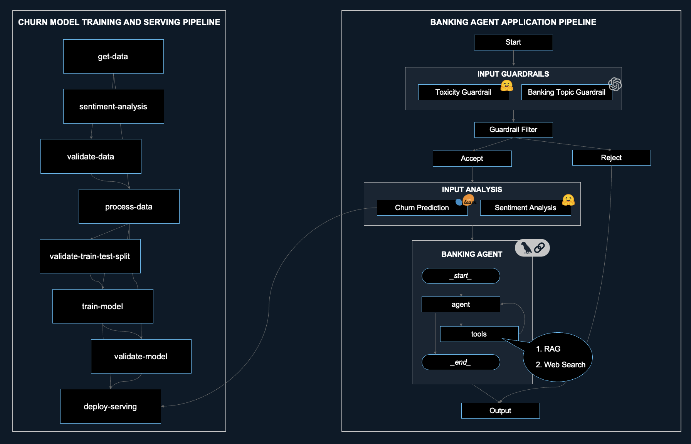
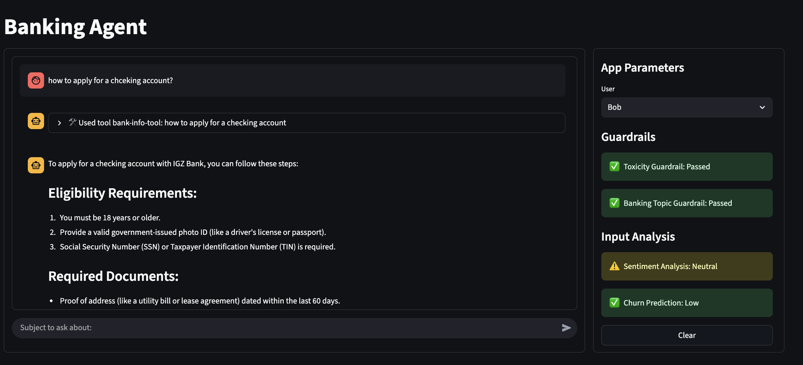
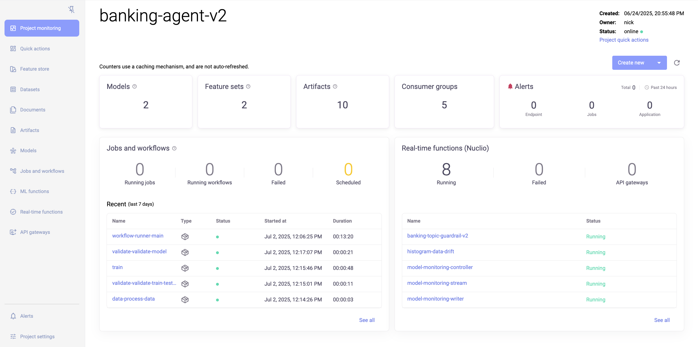
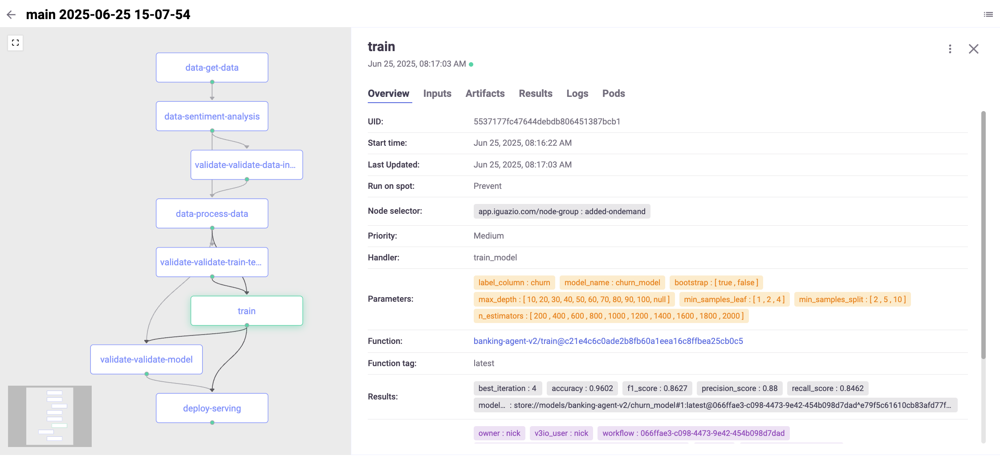
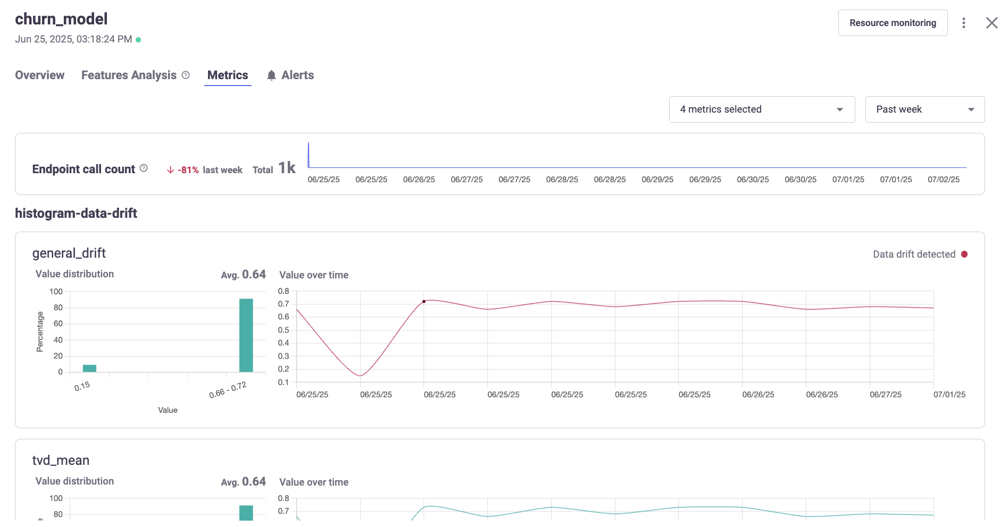
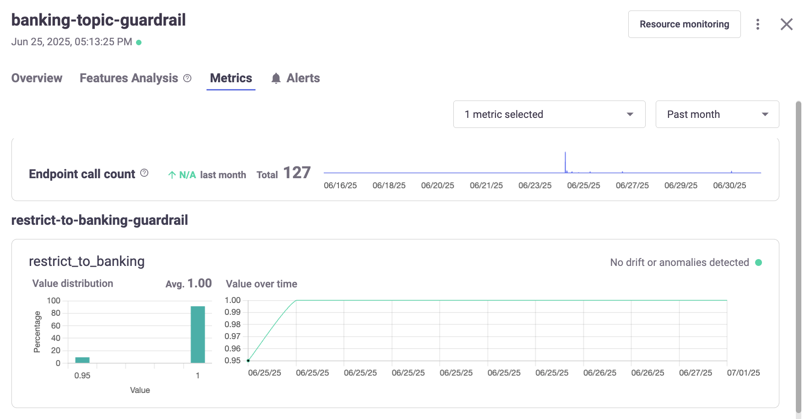

# Banking Agent Demo

## Overview
This demo showcases a modular, production-grade banking customer service chatbot. It combines traditional machine learning (churn propensity) and large language models (LLMs) in a single, observable inference pipeline. The system features conditional routing based on guardrails (banking topic and toxicity filtering), and dynamically adapts model behavior using conversation history, sentiment, and churn risk.

The architecture is customizable, with observability for project, tabular, and generative models. MLRun is used to orchestrate the entire workflow, from data processing to model deployment and serving.


**Business Use Case:**
- Banking customer service chatbot with conditional routing
- Model behavior adapts to conversation history, sentiment, and churn propensity
- Modular, customizable architecture
- Observability for project, tabular, and generative models

**Technical Capabilities:**
- End-to-end ML pipeline: training and serving for churn prediction
- Guardrail deployment: banking topic and toxicity filtering
- LLM as a judge: monitoring guardrail performance
- RAG (retrieval-augmented generation): data ingestion and retrieval
- Application serving graph: input guardrails, enrichment, and agent invocation
- Streamlit UI: displays guardrail, enrichment, and tool outputs
- Monitoring for both tabular ML and generative models

### Architecture


### Application UI


### Project Observability & Model Monitoring

#### Project Observability


#### Pipeline Orchestration + Experiment Tracking


#### Tabular Model Monitoring


#### Generative Model Monitoring


## Prerequisites
1. Install dependencies:

   ```bash
   conda create -n banking-agent python=3.11 ipykernel -y
   conda activate banking-agent
   pip install -r requirements.txt
   # or uv pip install -r requirements.txt
   ``` 
   
   Be sure to use this conda environment as the kernel for the following Juypter notebooks.

2. Set up MLRun:

    [Configure MLRun](https://docs.mlrun.org/en/stable/install.html) with access to your cluster or local environment.

3. Set OpenAI credentials

    Copy the [env file](.env.example) as `ai_gateway.env` and update to include:
    - `OPENAI_API_KEY`: Your OpenAI API key.
    - `OPENAI_BASE_URL`: The base URL for OpenAI API.


## Demo Flow

### 1. **Churn Prediction Model**
  - **Notebook**: [01_churn_ml_model.ipynb](01_churn_ml_model.ipynb)
  - **Description**: Trains and deploys a churn prediction model using a Random Forest classifier. The pipeline includes dataset logging, remote pipeline execution, and endpoint testing. Model monitoring is enabled for both tabular ML and generative models.
  - **Key Steps:**
    - Project setup and configuration with MLRun.
    - Logging the churn dataset ([churn_dataset.csv](data/churn_dataset.csv)).
    - Running a remote pipeline for model training and deployment.
    - Testing the deployed model endpoint with batch and single predictions.
    - Simulating real-time traffic to the model endpoint.
  - **Key Files:**
    - [data/churn_dataset.csv](data/churn_dataset.csv): Sample dataset for training.
    - [src/model_monitoring_utils.py](src/model_monitoring_utils.py): Utilities for enabling model monitoring.
    - [src/functions/train.py](src/functions/train.py): Training logic for the churn model.
    - [src/functions/v2_model_server.py](src/functions/v2_model_server.py): Model serving logic.

### 2. **Guardrails**
- **Notebook**: [02_guardrail_deployment.ipynb](02_guardrail_deployment.ipynb)
- **Description**: Deploys guardrails to ensure safe and relevant interactions. Includes:
  - **Banking Topic Guardrail**: Uses an LLM to classify whether a question is banking-related, with a strict True/False output. Includes prompt engineering and example-based evaluation. Deployed as a model and as a serving function.
  - **Toxicity Guardrail**: Filters out toxic language using a classifier with a configurable threshold. Deployed as a serving function.
  - **LLM as a Judge Monitoring Application**: Uses an LLM to evaluate the correctness of guardrail outputs, providing monitoring and scoring for guardrail performance.
- **Key Steps:**
  - Project setup and secret management.
  - Prompt configuration for LLM-based guardrails.
  - Model logging and deployment for guardrails.
  - Batch testing of guardrail endpoints with example questions.
- **Key Files:**
  - [src/functions/banking_topic_guardrail.py](src/functions/banking_topic_guardrail.py): Banking topic guardrail logic.
  - [src/functions/toxicity_guardrail.py](src/functions/toxicity_guardrail.py): Toxicity guardrail logic.
  - [src/functions/llm_as_a_judge.py](src/functions/llm_as_a_judge.py): LLM-based evaluation for guardrails.
  - [src/no-op.pkl](src/no-op.pkl): Placeholder model artifact for guardrail deployment.

### 3. **Application Deployment**
- **Notebook**: [03_application_deployment.ipynb](03_application_deployment.ipynb)
- **Description**: Deploys the full application, integrating the churn model, guardrails, and additional analysis into a serving graph. The application includes a context-aware LLM agent, sentiment analysis, and a Streamlit-based UI for interactive testing.
- **Key Features:**
  - Ingests markdown knowledge base files for RAG (retrieval-augmented generation) using Milvus vector store.
  - Sets up a serving graph with input guardrails (toxicity and banking topic), input analysis (sentiment and churn prediction), and a context-building step for the LLM agent.
  - Integrates a custom `BankingAgent` LLM server with context and vector database retrieval.
  - Provides a Streamlit UI for chat-based interaction, displaying guardrail and analysis outputs.
  - Includes mock server testing and deployment to Kubernetes.
- **Key Files:**
  - [src/functions/agent_graph_v2.py](src/functions/agent_graph_v2.py): Defines the application serving graph.
  - [src/functions/banking_topic_guardrail.py](src/functions/banking_topic_guardrail.py): Implements the Banking Topic Guardrail using an LLM for topic classification.
  - [src/functions/toxicity_guardrail.py](src/functions/toxicity_guardrail.py): Implements the Toxicity Guardrail for filtering toxic language.
  - [src/functions/llm_as_a_judge.py](src/functions/llm_as_a_judge.py): Provides LLM-based evaluation and monitoring for guardrail performance.
  - [src/functions/frontend_ui.py](src/functions/frontend_ui.py): Streamlit frontend UI application for chat interface with display for guardrails and input analyses.
  - [data/general_bank_info_kb.md](data/general_bank_info_kb.md), [data/checking_savings_kb.md](data/checking_savings_kb.md), [data/customer_faq.md](data/customer_faq.md): Knowledge base files for RAG.
  - [requirements-agent.txt](requirements-agent.txt): Requirements for the agent and serving graph.
